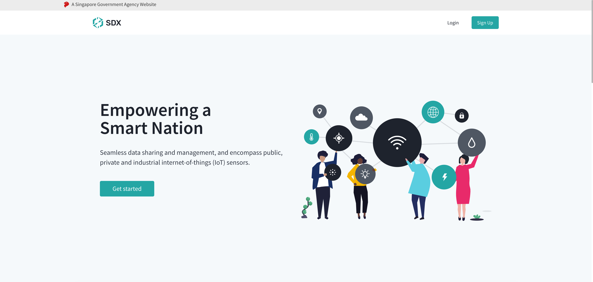
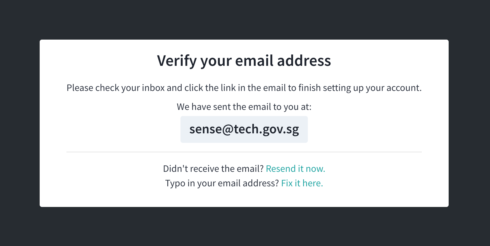
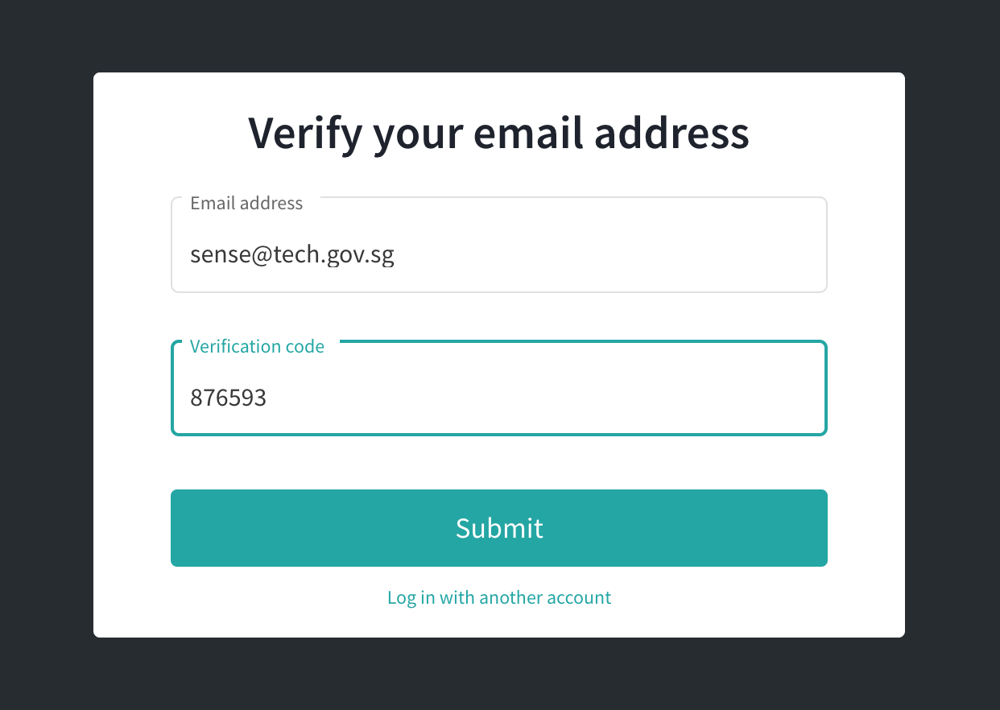

# Home Page

This area is the main page or the Home page. 

## Sign Up

For first time users, you must register to get started to use the system.

To sign up:

1. Navigate to Home page and click **Sign up**.

   Fill in the following information.

- Name
- Organisation
- Email address – Must be a valid gov.sg email id
- Mobile number – Must be 8-digit in number
- Password – For the password strength, these are the criteria to fulfill:

  - At least 12 characters long
  - One uppercase and one lowercase letter
  - At least 1 number
  - At least 1 special character (space is not allowed)
  
- Confirm Password

  

2. Verify your email address.

  

3. From the verification email, click the verify email address link.

  [Insert screenshot - Use Link from the Email]

4. Enter the access code provided and click **Submit**. 

  

5. Once the account is successfully verified, log in using your username and password.

  [Insert screenshot - Log in using Verified Account]

6. Now, set up multifactor authentication (MFA) by clicking **Authenticator App**.

   You must first set up your MFA to be able to login. The MFA allows you to have additional layer of security when logging in.

    The MFA set up screen appears and prompt you to start setting up with the option of Authenticator App. Only the Authenticator App is available for now and SMS Authentication will be available in future.

   [Insert screenshot - Setup MFA]

7.	Follow the steps as displayed on the screen. 

    Enter the TOTP received from the TOTP-generating app with 6-digit code to link the app. Click **Done**.

   [Insert screenshot - Steps to Setup Authenticator App]

8.	Scan the QR code with a TOTP-generating app like Google Authenticator or Authy.

   [Insert screenshot - Google Authentocator]

   Enter the TOTP received from the TOTP-generating app with 6-digit code to link the app. Click **Done**.

   [Insert screenshot - Enter authenthication Code]

9.	Once the account is successfully setup, log in again. 

   [Insert screenshot - Log in to Account]

10.	After you log in, enter the authentication 6-digit-code from your Authenticator App. Click **Done**.

   [Insert screenshot - Enter authentication code to Complere Sign Up]

Upon successful log in, the Browse Topics page displays, see [Insert x-ref - Browse Topics]

## Log in 

To log in:

1.	Navigate to Home page and click **Login**.
2.	Enter your registered email address and password.
3.	Click **Login**.

   

4.	After you log in, enter the authentication 6-digit-code from your Authenticator App. Click **Done**.

   [Insert screenshot - Authentication Code]

Upon successful log in, the Browse Topics page displays, see [Insert x-ref - Browse Topics]

## Forgot Password

To reset password:

1.	Click **Forgot Password** and enter your registered email address. 
2.	Click **Send recovery link**.

   [Insert Screenshot - Forgot password?]

You will receive an email to the registered email address with the password reset link. Click the reset password link.

   [Insert screenshot - Reset Password Link]

3.	Enter the following information:

- Confirmation Code
- Email
- Password
- Confirm Password

4.	Click **Reset Password**.

  [Insert screenshot - Reset Password]

  Once reset password is successful, you will now be able to login to your account with your new password.

  [Inseert screenshot - Reset Password Successful]

## Profile Icon

Navigate to Profile Icon to perform the following:

- Account Settings – Click to update user information
- Feedback – Click to provide feedback such as future enhancements and improvements
- Manage Users – Only Administrator role can view and manage users, see [Insert x-ref - Manage Users]
- Report vulnerabilities – Click to report vulnerability using this [link](https://www.tech.gov.sg/report_vulnerability)
- Logout – Click to log out to the application

### Account Settings

You can update information in the Account Settings.

To update account:

1.	Navigate to Profile Icon and click **Account Settings**.
 
**Note:** *You can update name, mobile number, and password.*

*Validation includes:*
- *Mobile number must be 8-digit number.*
- *Password must meet the following requirements:*
  - *At least 12 characters long*
  - *Uppercase and Lowercase letters*
  - *At least 1 number*
  - *At least 1 special character (space is not allowed)*
  
  [Insert screenshot - Update Personal Information]
  
To change password:

1.	Navigate to Password and click **Change**.
2.	Enter the following information to change password:

    - Confirm password
    - New password
    - Confirm new password

3.	Click **Change password**.

   [Insert screenshot - Change Password]

   Once change password is successful, you will be asked to logged out and log in again with your new password.

   [Insert screenshot - Change Password Succesful]

### Feedback

To provide feedback:

1.	Navigate to Profile icon and click **Feedback**.
2.	Write feedback in the input box and select the type of feedback.

   - Bugs
   - Suggestions
   - Others

3.	Click **Send Feedback**.

   [Insert screenshot - Send Feedback]

### Manage Users

Allows you to add and manage users within your agency. Only the Administrator can view and manage this page. 

In this page, you can view the following:

- Name – Displays the name of the user
- Email – Displays the email address
- Role – Displays the role assigned to the user
- Status – Displays the status of the user account
  - Active
  - Disabled
  - Verifying
  - Locked
  
- Action – Displays the action you can perform based on user status

  [Insert screenshot - Manage and Add Users]

You can add more user on the list by clicking **Add User**. 

To add user:

1.	Navigate to Profile Icon and click **Manage Users**. The Manager Users page displays.
2.	Click **Add User**.
3.	Enter email address.
4.	Select from the dropdown the role to assign to new user.
5.	Click **Done**. The new user is added successfully to the list of users and the status is Active.

[Insert screenshot - Add User]

By clicking **Action**, you can perform certain action based on the following status.

- Active status

  - Locked – Click to lock the user account
  - Disable – Click to disable the user account
  - Changed Role – Click to change the role assigned to the user as Publisher, Subscriber, and Administrator
  	
- Disabled status

  - Enable – Click to enable again the user account created
  
- Verifying status 

  - Resend code – Click to resend code again to the user
  - Disable – Click to disable the user account
  
- Locked status– Click to unlock the user account

### Report Vulnerability

To report vulnerability:

1.	Navigate to Profile Icon and click **Report Vulnerability**. You will be redirected to a new link portal. 

[Insert screenshot - Report Vulnerability Link Portal]

### Logout

To log out:

1.	Navigate to Profile Icon and click **Logout**.

[Insert screenshot - Logout]

